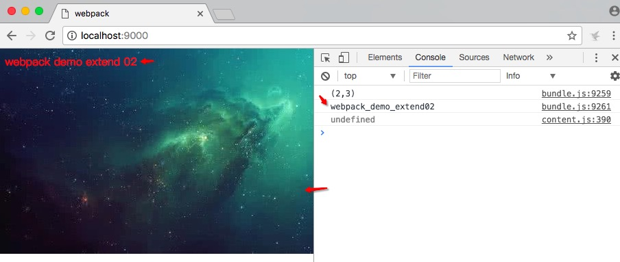
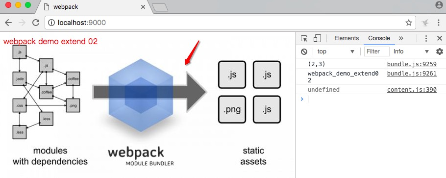
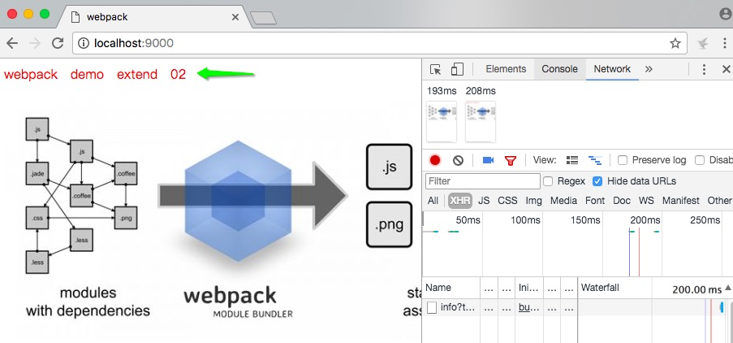

## webpack 的延伸 02 :blush:

咦咦咦，你还看着👀呢！欢迎👏接着看我的这个webpack系列--**webpack的延伸2**。在上一篇的文章中，自己主要是实现了下面的这三个功能：

- 实现es6语法的支持

- 处理css

- 整合less

如果你对这三个不是很熟练的话，虽然本文档的接下来的学习影响可以忽略不计，但是还是建议你回头看下[webpack_extend01](./webpack_extend01.md)。

**提示** -- 本文档实现的项目的是在项目--[webpack_demo_extend01](./webpack_demo_extend01/)的基础上实现的。

下面我们将来学习--

1.加载图片

在没有实现的之前，我修改了下一下文件`src/index.less`，内容如下

```less

body{
    background:url('https://ss1.bdstatic.com/70cFvXSh_Q1YnxGkpoWK1HF6hhy/it/u=1510363862,3286190187&fm=26&gp=0.jpg') no-repeat;
    p{
        color:red;
    }
}

```

其他的是些标识性的文案的小改动，这里不贴出来。

在改动之口，我执行`npm run dev`之后，得到浏览器的截图如下：

<a id="original_font"></a>



咦，很神奇，是吧，背景图已经导进去了啊，拿还讲个啥。可以，你留意到`background:url('https://ss1.bdstatic.com/70cFvXSh_Q1YnxGkpoWK1HF6hhy/it/u=1510363862,3286190187&fm=26&gp=0.jpg') no-repeat;`，它的url是一个cdn的链接。如果换成本地的图片链接会怎样呢？

我在根目录下新建了一个文件夹`assets`,在此文件夹下面新建`images`文件夹，再在此文件夹下面添加自己找的图片`webpack_image.jpeg`。那么，我直接替换掉相关的`background里面的url为background:url('../assets/images/webpack_image.jpeg')就行了呢`？答案是不行的。如果怀疑，你可以下载本文档相关的项目--[webpack_demo_extend02](./webpack_demo_extend02/)来修改运行一下了咯。

要实现本地的图片的资源下载的话，就需要使用到`file-loader`加载器。使用`file-loader`，我们可以轻松地将这些内容混合到`CSS`中：下面实现一下这个加图片--

1.1安装相关的依赖 'file-loader'

进入根目录，在控制台上面执行`npm install --save-dev file-loader`

1.2添加处理规则

 进入`webpack.config.dev.js`中，修改`module`字段如下：

 ```javascript

    ...
    module:{
        rules:[
            {// 处理js-es6的规则
                test:/\.js$/,//处理的文件的后缀名
                use:['babel-loader'],//处理的加载器是loader
                include:path.join(__dirname,'src')//包含的路径
            },
            {//处理css的规则,处理less的规则
                test:/\.less$/,
                use:[
                    {loader:'style-loader'},//style-loader 和 css-loader 的顺序是不能够颠倒的
                    {
                        loader:'css-loader',
                        // options:{
                        //     modules:true
                        // }
                    },
                    {loader:'autoprefixer-loader'},
                    {loader:'less-loader'},
                ]
            },
            {//处理图片资源
                test:/\.(png|svg|jpg|jpeg|gif)$/,//这里处理了以.png .svg .jpg .jpeg .gif为后缀名的图片
                use:[
                    {loader:'file-loader'}
                ]
            }
        ]
    }
    ...

 ```

 完成上面的两个步骤之后，执行`npm run dev`，可以在浏览器中查看到下面的截图效果，背景图已经被加载出来了--

 

 至此，已经完成了`css`中加载图片，可是在`.html`文件中加载图片呢？

 下面注释掉`src/index.less`中的背景图的代码：

 ```javascript

body{
    //background:url('../assets/images/webpack_image.jpeg') no-repeat;
    p{
        color:red;
    }
}


```

然后在`static/index.html`中添加下面的``标签信息：

```javascript

...
<body>
    <p>webpack demo extend 02</p>
    
</body>
...

```

去掉`src/index.less`中的背景图主要是因为自己在`static/index.html`的图片标签中使用了同一张图片哈，避免造成视觉的混乱。

完成上面的操作之后，运行`npm run dev`之后，浏览器中没有出现相关的图片。为啥？

因为上面的`file-loader`是解析了`css`中的图片的资源，当然，为了语义话一些，你可以将`file-loader 替换成 url-loader`，这要安装`url-loader` 的依赖先，这里就不详细讲了，有兴趣的话可以自己来动手了咯。

要实现`.html`中的图片的加载，需要使用到`html-loader`，具体实现如下：

1.3安装'html-loader'依赖

在控制台上上面执行`npm install --save-dev html-loader`。

1.4更改匹配规则

进入到`webpack.config.dev.js`，在`module`字段中添加后如下:

```javascript

    ...
    module:{
        rules:[
            {// 处理js-es6的规则
                test:/\.js$/,//处理的文件的后缀名
                use:['babel-loader'],//处理的加载器是loader
                include:path.join(__dirname,'src')//包含的路径
            },
            {//处理css的规则,处理less的规则
                test:/\.less$/,
                use:[
                    {loader:'style-loader'},//style-loader 和 css-loader 的顺序是不能够颠倒的
                    {
                        loader:'css-loader',
                        // options:{
                        //     modules:true
                        // }
                    },
                    {loader:'autoprefixer-loader'},
                    {loader:'less-loader'},
                ]
            },
            {//处理图片资源,样式
                test:/\.(png|svg|jpg|jpeg|gif)$/,//这里处理了以.png .svg .jpg .jpeg .gif为后缀名的图片
                use:[
                    {loader:'file-loader'}
                ]
            },
            {//处理html，插入在html中的图片img用此处理
                test:/\.html$/,
                use:[
                    {loader:'html-loader'}
                ]
            }
        ]
    }
    ...

```

这时候执行`npm run dev`之后就可以看到👀 正常的效果了咯。

2.加载字体

`file-loader `和` url-loader `可以接收并加载任何文件，然后将其输出到构建目录。这就是说，我们可以将它们用于任何类型的文件，包括字体。下面来更新下`webpack.config.dev.js`中的模块（module）字段：

```javascript

    ...
    module:{
        rules:[
            ...
            {//处理字体
                test:/\.(woff|woff2|eot|ttf|otf)$/,
                use:[
                    'file-loader'//等同于{loader:'file-loader'}
                ]
            },
            ...
        ]
    }
    ...

```

引入测试的字体，在`assets`文件夹中添加文件夹`font`，将我下载的字体`my-font.woff 和 my-font.woff2 （已经重命名过了哈）`添加到新建的 `font`文件夹里面。

修改`src/index.less`文件。如下：

```less

 @font-face {
   font-family: 'MyFont';
   src:  url('../assets/fonts/my-font.woff2') format('woff2'),
         url('../assets/fonts/my-font.woff') format('woff');
   font-weight: 600;
   font-style: normal;
}

body{
    //background:url('../assets/images/webpack_image.jpeg') no-repeat;
    p{
        font-family: 'MyFont';//为p添加字体
        color:red;
    }
}

```

执行`npm run dev`，在`localhost:9000`看到效果如下面的截图：



也许你看不出和之前没添加字体（默认）的文字的区别，你可以点击[原文字效果](#original_font)查看！


