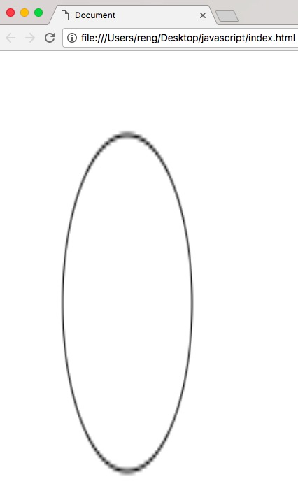
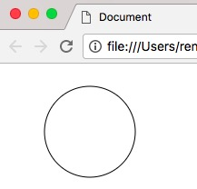

## 屏幕适配_图形变形问题

### 问题出现

在实际的开发中，自己需要将canvas的画布大小调整为自己设定的尺寸，比如全屏。这个时候在上面绘制的图形就产生了变形的状态，这不是我们想要的，应该如何解决呢？


### 解决方案

在未实现解决方案之前，相关代码如下：

```javascript

var c=document.getElementById("canvas");
var ctx=c.getContext("2d");

//设置canvas的宽高
var width = parseInt(document.documentElement.clientWidth);
var height = parseInt(document.documentElement.clientHeight);
var cssText = 'width:'+width+'px;height:'+height+'px';
canvas.setAttribute('style',cssText);


ctx.beginPath();
ctx.arc(100,75,50,0,2*Math.PI);
ctx.stroke();
ctx.closePath();

```

上面的图形出现变形，如下：




我修正后的代码如下：

```javascript

var c=document.getElementById("canvas");
var ctx=c.getContext("2d");

//设置canvas的宽高
var width = parseInt(document.documentElement.clientWidth);
var height = parseInt(document.documentElement.clientHeight);
var cssText = 'width:'+width+'px;height:'+height+'px';
canvas.setAttribute('style',cssText);
canvas.width = width;//add content
canvas.height = height;//add content


ctx.beginPath();
ctx.arc(100,75,50,0,2*Math.PI);
ctx.stroke();
ctx.closePath();

```

**原因说明**

canvas.width/height和canvas.style.widght/height是两个完全不一样的东西。

canvas内部的所有元素都是根据canvas.width/height来进行定位画图的，所以有些物体会被严重拉长。

所以在设定了canvas.style之后也要设置canvas.width/height，这样子就不会变形啦。

相关截图如下：


