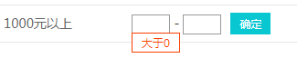

## tool_tip 实现边上提示信息

在实际的开发中，有时候需要在元素的隔壁进行相关信息的提示，如下图：



我这里是介绍使用jquery来实现这种效果**我这里使用的jquery的版本是3.2.1**,具体的实现如下:

```html

    .
    <li><input type="text" class="input begin" title="大于0">&nbsp;-&nbsp;<input type="text"class="input end" title="大于上一个输入，小于9999999"><button>确定</button></li>
    .

```
上面`li`标签里的样式自行决定，这里就不进行编写了咯:blush:

```javascript

    /**
     * tooltip的提示
     */
     
    (function(){
        $(document).find("input").mouseenter(function(){
            // 移除本身带有的提示
            this._title = this.title;
            this.title="";
            var _this = $(this);

            var tooltip = "<div id = 'tooltip'>"+this._title+"</div>";
            $("body").append(tooltip);
            $("#tooltip").css({
                "top":_this.offset().top + _this.height() + "px",
                "left":_this.offset().left + "px"
            }).show("fase");
        }).mouseout(function(){
            this.title = this._title;
            $("#tooltip").remove();
        });
    })();

```
在上面的`javascript`代码中插入了一个ID为`tooltip`的元素，下面对这个元素做相关的css编写，你可以根据自己的风格进行编写。

```css

// tooltip的提示
 #tooltip{
  position:absolute;
  font-size: 12px;
  border:1px solid #333;
  background:#fff;
  color:#f93f00;
  border:1px solid #f93f00;
  height: 20px;
  padding:0 10px;
  line-height: 20px;
  display:none;
 }

```

按照上面的实现可以完成图片中鼠标移动到相关的元素显示效果，移开元素移除效果的提示功能。


### 在实现中遇到的问题

1.在初步的时候，实现了额外的效果的展示外，本身的元素也是自带一个展示`title`属性的效果。那么就要将默认的效果给移除掉

可以通过将title属性设置为空的字符串就可以了

```javascript

this._title = this.title;
this.title="";

```

2.装换成为鼠标所在位置显示

这个功能，更改一下鼠标的事件就行了，详细代码如下：

```javascript

    (function(){
        $(document).find("input").mouseenter(function(e){
            // 移除本身带有的提示
            this._title = this.title;
            this.title="";

            var tooltip = "<div id = 'tooltip'>"+this._title+"</div>";
            $("body").append(tooltip);
            $("#tooltip").css({
                "top":e.pageY + "px",
                "left":e.pageX + "px"
            }).show("fase");
        }).mouseout(function(){
            this.title = this._title;
            $("#tooltip").remove();
        });
    })();

```


