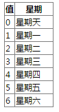

## 这是对象new Date()的相关方法

- getDate方法 
	返回Date对象中用本地时间表示的一个月中的日期值
	`用法:dateObj.getDate(),返回的是1-31之间的整数，它代表了相应的Date对象中的日期值`

- getDay方法
	返回 Date 对象中用本地时间表示的一周中的日期值</p>
	`用法：dateObj.getDay(),getDay ,方法所返回的值是一个处于 0 到 6 之间的整数，它代表了一周中的某一天，返回值与一周中日期的对应关系如下：`
	

- getFullYear方法
	返回 Date 对象中用本地时间表示的年份值。
	`用法：dateObj.getFullYear()，getFullYear 方法以绝对数字的形式返回年份值`

- getHours方法
	返回 Date 对象中用本地时间表示的小时值。
	`用法：dateObj.getHours()，getHours 方法返回一个处于 0 到 23 之间的整数，这个值表示从午夜开始计算的小时数。在下面两种情况下此方法的返回值是 0：时间在 1:00:00 am 之前，或者在创建 Date 对象的时候没有将时间保存在该对象中。而要确定究竟是哪种情况，唯一的方法就是进一步检查分钟和秒钟值是否也是 0。如果这两个值都是 0，那就几乎可以确定是没有将时间值保存到 Date 对象中。`

- getMilliseconds方法
	返回 Date 对象中用本地时间表示的毫秒值。
	`用法：dateObj.getMilliseconds()，所返回的毫秒值处于 0-999 之间。`
	`1秒等于1000毫秒`

- getMinutes方法 
	返回 Date 对象中用本地时间表示的分钟值。
	`用法：dateObj.getMinutes()，getMinutes 方法返回一个处于 0 到 59 之间的整数，返回值就等于保存在 Date 对象中的分钟值。在下面两种情况下返回值为 0：在时钟整点之后经过的时间少于一分钟，或者是在创建 Date 对象的时候没有将时间值保存到该对象中。而要确定究竟是哪种情况，唯一的方法是同时检查小时和秒钟值是否也是 0。如果这两个值都是 0，那就几乎可以确定是没有将时间值保存到该 Date 对象中。`

- getMonth 方法 
	返回 Date 对象中用本地时间表示的月份值。
	`用法：dateObj.getMonth(),getMonth 方法返回一个处于 0 到 11 之间的整数，它代表 Date 对象中的月份值。这个整数并不等于按照惯例来表示月份的数字，而是要比按惯例表示的值小 1。如果一个 Date 对象中保存的时间值是 "Jan 5, 1996 08:47:00"，那么 getMonth 方法就会返回 0。`

- getSeconds方法 
	返回 Date 对象中用本地时间表示的秒钟值。
	`用法：dateObj.getSeconds(),getSeconds 方法返回一个处于 0 到 59 之间的整数，它表示了相应的 Date 对象中的秒钟值。在下面两种情况下，返回值为 0。第一种情况是在当前的一分钟中所经过的时间少于一秒。另外一种情况是在创建 Date 对象时没有将时间值保存到该对象中。而为了确定究竟属于哪种情况，唯一的方法是同时检查小时和分钟值是否也都是 0。如果这两个值都是 0，那就几乎可以确定是没有将时间值保存到 Date 对象中。`

- getTime方法 
	返回 Date 对象中的时间值。
```
	用法:dateObj.getTime(),getTime 方法返回一个整数值，这个整数代表了从 1970 年 1 月 1 日开始计算到 Date 对象中的时间之间的毫秒数。日期的范围大约是 1970 年 1 月 1 日午夜的前后各 285,616 年。负数代表 1970 年之前的日期。</p>
	<p>在进行各种日期和时间换算的时候，可以定义一些变量来表示一天、一个小时或一分钟中包含的毫秒数。这样做通常是很有帮助的。例如
	var MinMilli = 1000*60
	var HrMilli = MinMilli * 60
	var DyMilli = HrMilli * 24
```


> 参考链接
	[javascript手册](http://shouce.jb51.net/jscript/index.html)
