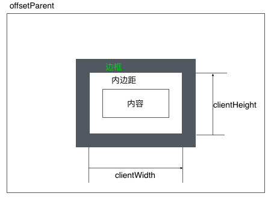
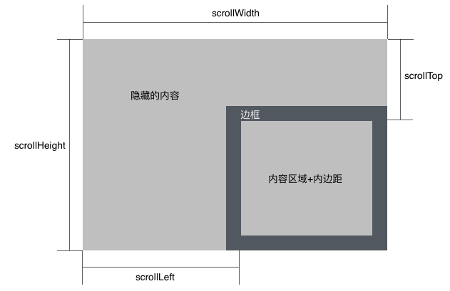

## 元素大小的说明

> 偏移量

``` 

offsetHeight:
	元素在垂直方向上占用的空间的大小，以像素计算。包括元素的高度、（可见的）水平滚动条的高度、上边框的高度和下边框的高度

offsetWidth:
	元素在水平方向上占用的空间的大小，以像素计算。包括元素的宽度、（可见的）水平滚动条的宽度、左边框的宽度和右边框的宽度

offsetLeft:
	元素的左外边框至包含元素的左内边框之间的像素的距离

offsetTop:
	元素的上外边框至包含元素的下内边框之间的像素的距离

```

> 客户区大小

```

clientHeight:
	元素的内容区域高度加上上下内边距的高度距离，以像素计算。

clientWidth:
	元素的内容区域宽度加上左右内边距的宽度距离，以像素计算。

```

> 滚动大小

```

scrollHeight:
	在没有滚动的条件下，元素内容的总的高度

scrollWidth:
	在没有滚动的条件下，元素内容的总的宽度

scrollLeft:
	被隐藏在内容区域左侧的像素数。通过设置这个属性可以改变元素的滚动位置.

scrollTop:
	被隐藏在内容区域上侧的像素数。通过设置这个属性可以改变元素的滚动位置。

```