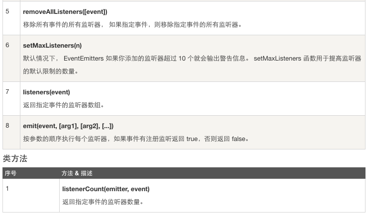

## nodejs EventEmitter

> nodejs 所有的异步i/o操作在完成时都会发送一个事件到事件队列。
nodejs 里面的许多对象都会分发事件：一个net.Server对象会在每次有新连接时候分发一个事件，一个fs.readStream对象会在文件被打开的时候发出一个事件。所有这些产生事件的对象都是event.EventEmitter的实例。


### EventEmitter类

event模块只提供了一个对象：events.Emitter。EventEmitter的核心就是事件触发和事件监听器功能的封装。
可以通过require('events')来访问该模块。
```javascript

//引入events模块
var events = require('events');

//创建eventEmitter对象
var eventEmitter = new events.EventEmitter();

```
EventEmitter对象如果在实例化时发生错误，会触发error事件。当添加新的监听器的时候，newListener事件会触发，当监听器被移除时，removeListener事件被触发。
下面是一个简单的例子说明EventEmitter的用法。
```javascript

//event.js文件
var EventEmitter = require('events').EventEmitter;
var event = new EventEmitter();
event.on('some_event',function(){
	console.log('some_event 事件触发');
});
setTimeout(function(){
	event.emit('some_event');
},1000);

```
执行结果如下：
运行上面的那段代码之后，1秒后控制台输出了`some_event事件触发`，其原理是event对象注册了事件some_event的一个监听器，然后通过setTimeout在1毫秒以后向event对象发送事件some_event，此时会调用some_event的监听器。

```javascript

$ node event.js
some_event 事件触发

```
EventEmitter的每个事件是由一个事件名和若干的参数组成，`事件名是一个字符串，通常表达一定的语义`，对每个事件，EventEmitter支持若干个事件监听器。
当事件触发时，注册到这个事件的事件监听器被一次调用，事件参数作为回调函数参数传递。
以下的例子解析这个过程：
```javascript

//event.js文件
var events = require('event');
var emitter = new events.EventEmitter();

emitter.on('someEvent',function(arg1,arg2){
	console.log('listener1',arg1,arg2);
});
emitter.on('someEvent',function(arg1,arg2){
	console.log('listener2',arg1,arg2);
});

emitter.emit('someEvent','arg1 参数','arg2 参数');

```
执行上面的代码，运行的结果如下：
```javascript

$ node event.js

listener 1 arg1 参数 arg2参数
listener 2 arg1 参数 arg2参数

```
以上的例子，emitter为事件someEmitter注册了两个事件的监听器，然后触发了someEvent事件。
运行结果中可以看到两个事件监听器回调函数先后被调用。这就是EventEmitter最简单的用法。
EventEmitter还提供了多个属性，如on和emit 。`on函数用于绑定事件函数，emit属性用于触发一个事件`。

下面的截图是EventEmitter的属性介绍：





### 实例
以下实例通过connection(连接)事件演示了EventEmitter类的应用。
创建main.js文件，代码如下：
```javascript

var events = require('events');
var eventEmitter = new events.EventEmitter();

//监听器 #1
var listener1 = function listener1(){
	console.log('监听器 listener1 执行。')；
}

//监听器 #2
var listener2 = function listener2(){
	console.log('监听器 listener2 执行。')；
}

//绑定 connection 事件，处理函数为listener1
eventEmitter.on('connection',listener1);

//绑定 connection 事件，处理函数为listener2
eventEmitter.on('connection',listener2);

var eventListeners = require('events').EventEmitter.listenerCount(eventEmitter,'connection');
console.log(eventListeners + '个监听器监听连接事件。');

//处理connection事件
eventEmitter.emit('connection');

//移除监绑定的 listener1 函数
eventEmitter.removeListener('connection',listener1);
console.log('listener1 不再接受监听。');

//触发connection事件
eventEmitter.emit('connection');

eventListeners = require('events').EventEmitter.listenerCount(eventEmitter,'connection');
console.log(eventListeners+'个监听器监听连接事件');

console.log('程序执行完毕。')；

```
以上的代码，执行结果如下所示：
```javascript

$ node main.js
2 个监听器监听连接事件。
监听器 listener1 执行。
监听器 listener2 执行。
listener1 不再受监听。
监听器 listener2 执行。
1 个监听器监听连接事件。
程序执行完毕。

```


