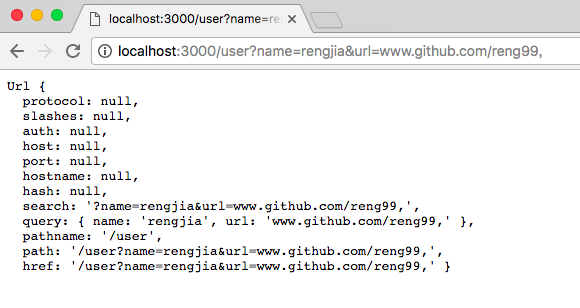
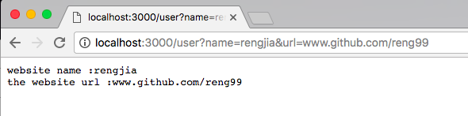
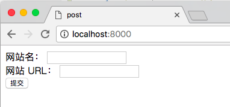
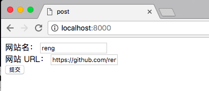
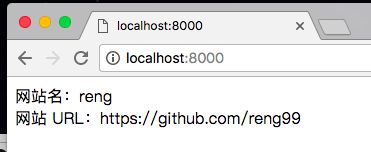

## nodejs get/post请求

> 在很多的场景中，服务器需要跟用户的浏览器打交道，如表单提交。
表单提交到服务器一般都是使用get/post请求。

### 获取get请求内容
由于get请求直接嵌入到路径中，[url](http://nodejs.cn/api/url.html)是完整的请求的路径，包含了？后面的部分，因此你可以手动解析后面的内容作为get请求的参数。
nodejs中url模块中的parse函数提供了这个功能。
#### 实例
```javascript

var http = require('http');
var url = require('url');
var util = require('util');

http.createServer(function(req,res){
	res.writeHead(200,{'Content-Type':'text/plain'});
	res.end(util.inspect(url.parse(req.url,true)));
}).listen(3000);

```
运行后在浏览中访问 `http://localhost:3000/user?name=rengjia&url=www.github.com/reng99`,然后查看返回结果：



> 获取url的参数
可以使用[url.parse](../../javascript/attention/json/parse.js)方法来解析url中的参数，代码如下：
#### 实例
```javascript

var http = require('http');
var url = require('url');
var util = require('util');

http.createServer(function(req,res){
	res.writeHead(200,{'Content-Type':'text/plain'});

	//解析url参数
	var params = url.parse(req.url,true).query;
	res.write('name :+params.name);
	res.write('\n');
	res.write('the website url :'+params.url);
	res.end();
}).listen(3000);

```
同样的，运行后在浏览中访问 `http://localhost:3000/user?name=rengjia&url=www.github.com/reng99`,然后查看返回结果：



### 获取post请求内容
`post 请求的内容全部都在请求体中年，http.ServerRequest并没有一个属性内容为请求体，原因是等待请求体传输的可能是一件耗时的工作。`
比如传输文件，而很多时候我们可能并不需要理会请求体的内容，恶意的post请求会大大消耗服务器的资源，所有nodejs默认是不会解析请求体的，当需要的时候，需要手动来做。
#### 基本语法结构说明
```javascript

var http = require('http');
var querystring = require('querystring');
var util = require('util');

http.createServer(function(req,res){
	//定义一个post变量，用语暂时存放请求体的信息
	var post = '';

	//通过req的data事件监听函数，每当接收到请求体的数据，就累加到post变量中
	req.on('data',function(chunk){
		post += chunck;
	});

	//在end事件触发之后，通过 querystring.parse将post解析为真正的post请求格式，然后向客户端返回。
	req.on('end',function(){
		post = querystring.parse(post);
		res.end(util.inspect(post));
	});

}).listen(3000);

```
以下的实例表单通过post提交并输出数据：
#### 实例
```javascript

var http = require('http');
var querystring = require('querystring');
 
var postHTML = 
  '<html><head><meta charset="utf-8"><title>post</title></head>' +
  '<body>' +
  '<form method="post">' +
  '网站名： <input name="name"><br>' +
  '网站 URL： <input name="url"><br>' +
  '<input type="submit">' +
  '</form>' +
  '</body></html>';
 
http.createServer(function (req, res) {
  var body = "";
  req.on('data', function (chunk) {
    body += chunk;
  });

  req.on('end', function () {

    // 解析参数
    body = querystring.parse(body);

    // 设置响应头部信息及编码
    res.writeHead(200, {'Content-Type': 'text/html; charset=utf8'});
 
    if(body.name && body.url) { // 输出提交的数据
        res.write("网站名：" + body.name);
        res.write("<br>");
        res.write("网站 URL：" + body.url);
    } else {  // 输出表单
        res.write(postHTML);
    }

    res.end();
  });
}).listen(8000);

```
运行上面的代码，然后在浏览器上输入localhost:8000或者127.0.0.1:8000，示例如下：








